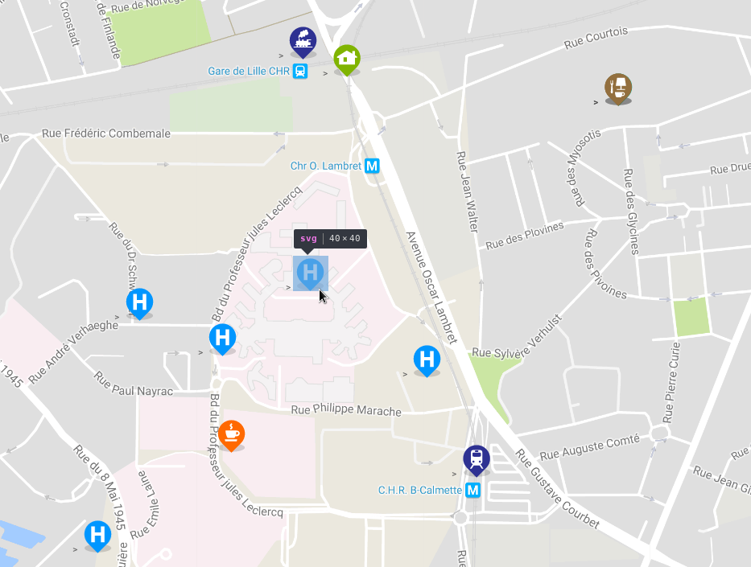
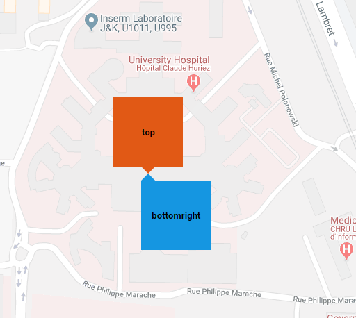

# vue3-gmap-custom-marker

[


](https://www.npmjs.com/package/vue3-gmap-custom-marker)


This component allows you to display custom HTML content on the map using Overlay.
This component is an update (a fork) from existing [component for vue 2](https://github.com/eregnier/vue2-gmap-custom-marker)
to be usable with vue 3 with the [vue3-google-map project](https://github.com/inocan-group/vue3-google-map)

it seems to work but some work but some adaptation from previous version remains to do to make it work properly.

## Demo

[Demo](https://vue3-gmap-custom-marker-demo.pages.dev/)

You might look at this [demo code repository](https://github.com/eregnier/vue3-gmap-custom-marker-demo) for features usage and complete exemple around this plugin.

## Features

- Display reactive custom html into markers on google map using slot system

- Live property change allows simple interaction with coordonates and zindex of html marker element

- Google map clustering IS NOT supported yet by the vue3 gmap project yet but should be possible in the future or with some extra work on this project.

- Simple positionning system for marker around the origin point

- Specific markers offset X and Y for more control about html element display

- Almost all API of the component is optional, just start with lon, lat property

- Work (around) with nuxt with (I don't know if this is still an issue with current version of nuxt and vue 3, this is information from vue2 plugin before fork) [this trick](https://github.com/eregnier/vue3-gmap-custom-marker/issues/15#issuecomment-544203425)

## Example



## Installation

Install the package from [npm](https://www.npmjs.com/package/vue3-gmap-custom-marker):

`npm i vue3-gmap-custom-marker`

## Basic Usage

Import the component and use it in the components object.

```javascript
import GmapCustomMarker from 'vue3-gmap-custom-marker';

export default = {
  [...],
  components: {
      'gmap-custom-marker': GmapCustomMarker
  },
  [...]
}
```

Use the custom marker inside the map component. Add HTML or other Vue components inside the custom marker to be rendered on the map.

```vue
<GmapMap>
  <gmap-custom-marker :marker="marker">
    
    <my-component></my-component>
  </gmap-custom-marker>
</GmapMap>

<script>
export default = {
  [...],
  data() {
    return {
      marker: {
        lat: 50.60229509638775,
        lng: 3.0247059387528408
      }
    }
  [...]
}
</script>
```

// Click is not tested yet (and native too)

```vue
<GmapMap>
  <gmap-custom-marker
    :marker="{ lat: 50.60229509638775, lng: 3.0247059387528408 }"
    @click="someFunction"
  >
    
    <my-component></my-component>
  </gmap-custom-marker>
</GmapMap>
```

Specify the alignment of the marker with the `alignment` prop. Accepts 13 values: `top`, `bottom`, `left`, `right`, `center`, `topleft` | `lefttop`, `topright` | `righttop`, `bottomleft` | `leftbottom`, `bottomright` | `rightbottom`. Defines the alignment of the marker relative to the lat/lng specified, e.g. `bottomright` - the marker will be below and on the right of the location.

```vue
<gmap-custom-marker :marker="marker" alignment="bottomright">
</gmap-custom-marker>
```



Manually specify an offset value for the marker in pixels with prop `offsetX` | `offsetY`. A positive `offsetX` moves the marker further right, and a positive `offsetY` moves the marker further down the page. Can be used with the `alignment` prop.

```vue
<gmap-custom-marker :marker="marker" :offsetX="-10" :offsetY="17.5">
</gmap-custom-marker>
```

## Reference

|  **Prop**   | **Type** | **Default** |                                                                        **Description**                                                                        |                                                               **Supported Values**                                                                |
| :---------: | :------: | :---------: | :-----------------------------------------------------------------------------------------------------------------------------------------------------------: | :-----------------------------------------------------------------------------------------------------------------------------------------------: |
|  `marker`   |  Object  |   `null`    |                                Provide the latitude and longitude values that the marker should be displayed at. **Required**                                 |                                 Provide an Object with `lat` and `lng` properties. `{ lat: Number, lng: Number }`                                 |
|  `offsetX`  |  Number  |     `0`     |                          The number of pixels to move the marker by in the x-direction. Postive values move the marker to the right                           |                                                           Positive or negative number.                                                            |
|  `offsetY`  |  Number  |     `0`     |                        The number of pixels to move the marker by in the y-direction. Postive values move the marker to down the page.                        |                                                           Positive or negative number.                                                            |
| `alignment` |  String  |    `top`    | The alignment of the marker element relative to the location it is displayed. e.g. `bottomright` - the marker will be below and on the right of the location. | `top`, `bottom`, `left`, `right`, `center`, `topleft` `lefttop`, `topright`, `righttop`, `bottomleft`, `leftbottom`, `bottomright`, `rightbottom` |
|  `zIndex`   |  Number  |    `50`     |                                                                    z-index of the marker.                                                                     |                                                                 Positive number.                                                                  |

## Licence

[MIT](https://en.wikipedia.org/wiki/MIT_License)

## Support

If you want to support this plugin it is possible :smile:

[](https://www.paypal.com/cgi-bin/webscr?cmd=_s-xclick&hosted_button_id=UV5GR9QWPAEMS)
